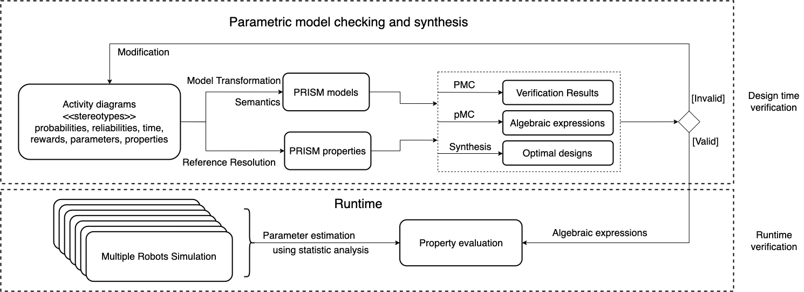

Quantitative Assurance and Synthesis of Controllers from Activity Diagrams (QASCAD)
---

This repository contains the open-source Eclipse-based QASCAD tool that we are developing in the [SESAME](https://www.sesame-project.org/) project to use probabilistic model checking (by [PRISM](https://www.prismmodelchecker.org/) and [Storm](https://www.stormchecker.org/)) to verify parametric probabilistic models captured in UML Acitivity Diagrams (ADs), explore their design space (based on parametric model checking), and further support the synthesis of the models. Please refer to our preprint article ["Quantitative Assurance and Synthesis of Controllers from Activity Diagrams"]() on arxiv.org for more details about our approach and the theoretical foundation underneath the tool.

Additionally, seven case studies, that we have evaluated using our tool, are also deposited here.

Table of Contents
---
- [Overview](#overview)
  - [our approach](#our-approach)
  - [Tool workflow](#tool-workflow)
- [What are contained in this repository?](#what-are-contained-in-this-repository)
- [How to use the tool?](#how-to-use-the-tool)
  - [Installation](#installation)
    - [Prerequisites](#prerequisites)
    - [Steps](#steps)
- [Structure of this repository](#structure-of-this-repository)


# Overview 
## our approach


## Tool workflow


# What are contained in this repository?
- [eclipse_workspace/AD2PRISM_Transfromation_workspace](./eclipse_workspace/AD2PRISM_Transfromation_workspace): an Eclipse workspace with all necessary projects to set up the tool, and the developing version of all case studies
  + [SysML_ActivityDiagram2PRISM](./eclipse_workspace/AD2PRISM_Transfromation_workspace/SysML_ActivityDiagram2PRISM/): code for model transformation using Epsilon
    * [Ant](./eclipse_workspace/AD2PRISM_Transfromation_workspace/SysML_ActivityDiagram2PRISM/Ant): an ANT build file for automating the [workflow](#tool-workflow).
    * [metamodels](./eclipse_workspace/AD2PRISM_Transfromation_workspace/SysML_ActivityDiagram2PRISM/metamodels/): the PRISM ecore metamodel.
    * [transformation](./eclipse_workspace/AD2PRISM_Transfromation_workspace/SysML_ActivityDiagram2PRISM/transformation/): code for validation, transformation, and generation in Epsilon.
  + [com.eclipsesource.workflow.profile](./eclipse_workspace/AD2PRISM_Transfromation_workspace/com.eclipsesource.workflow.profile/): a Papyrus UML profile for annotating activity diagrams with various stereotypes.
  + [org.eclipse.epsilon.ad2prism.tools](./eclipse_workspace/AD2PRISM_Transfromation_workspace/org.eclipse.epsilon.ad2prism.tools/): an Eclipse plugin used in ETL (transformation) to parse particular pattern in annotated properties.
  + [Digital_camera](./eclipse_workspace/AD2PRISM_Transfromation_workspace/Digital_camera/): a case study from literature
  + [IT_support_ctmc](./eclipse_workspace/AD2PRISM_Transfromation_workspace/IT_support_ctmc/): a case study from literature
  + [pal](./eclipse_workspace/AD2PRISM_Transfromation_workspace/pal/): a motiving and running example as discussed in the paper
  + [presto_autonomous_fruit_picking](./eclipse_workspace/AD2PRISM_Transfromation_workspace/presto_autonomous_fruit_picking/): a case study from literature
  + [six_dice](./eclipse_workspace/AD2PRISM_Transfromation_workspace/six_dice/): a case study from literature
  + [six_dice_parametric](./eclipse_workspace/AD2PRISM_Transfromation_workspace/six_dice_parametric/): a case study from literature
  + [Travel_management](./eclipse_workspace/AD2PRISM_Transfromation_workspace/Travel_management/): a case study from literature
  + [travel_web_ctmc](./eclipse_workspace/AD2PRISM_Transfromation_workspace/travel_web_ctmc/): a case study from literature


- [Examples](./Examples/): the release version of case studies, including activity diagrams, corresponding generated PRISM code and properties, and verification results for various Markov models

# How to use the tool?
QASCAD is an Eclipse-based tool, uses the [Papyrus](https://eclipse.dev/papyrus/) and [Epsilon](https://eclipse.dev/epsilon/) projects. In order to use it, we need to install an Eclipse and the corresponding plugins.

## Installation
### Prerequisites
Our tool generates PRISM code from UML activity diagrams. In order for verification, we need PRISM and/or Storm to be installed. Follow the [PRISM instruction](https://www.prismmodelchecker.org/download.php) or [Storm instruction](https://www.stormchecker.org/) to download and install PRISM or Storm.

- Remember to add "prism" and "storm" into your OS path. For example, add `export PATH=$PATH:/path/to/prism_installation/bin` in your `.bashrc` file

### Steps 
1. Install Java 17. For example, `$sudo apt install openjdk-17-jdk` on Ubuntu
2. Download the "Eclipse Modeling Tools" for your platform from [Eclipse 2023-03](https://www.eclipse.org/downloads/packages/release/2023-03/r)
3. Install the Eclipse
4. In Eclipse, choose "Install New Software", then "Manage", "Available Software Sites", uncheck "JustJ", "Latest Eclipse IDE...", "Latest Eclipse Simulation..."
5. In Eclipse, from "Available Software", choose "All Available Sites", then filter "Papyrus", install "Papyrus UML 6.4.0". Now Eclipse can open and edit Papyrus models.
6. Install Epsilon 2.4 in Eclipse using the update site (http://download.eclipse.org/epsilon/updates/2.4/)
   - Choose "Install New Software" and then add this update site
   - Choose "Epsilon core", "Epsilon EMF integration", and "Epsilon UML integration" to install
7. Import [SysML_ActivityDiagram2PRISM](./eclipse_workspace/AD2PRISM_Transfromation_workspace/SysML_ActivityDiagram2PRISM/), [com.eclipsesource.workflow.profile](./eclipse_workspace/AD2PRISM_Transfromation_workspace/com.eclipsesource.workflow.profile/) and [org.eclipse.epsilon.ad2prism.tools](./eclipse_workspace/AD2PRISM_Transfromation_workspace/org.eclipse.epsilon.ad2prism.tools/) projects into the new installed Eclipse
8. See [instruction](./eclipse_workspace/AD2PRISM_Transfromation_workspace/readme.md) to deploy the plugin "org.eclipse.epsilon.ad2prism.tools" into your Eclipse
9. Config Ant build: 
    * In Eclipse, "Windows", "Show View" and search "Ant" to show Ant tab
    * In the Ant tab, add the buildfile [build.xml](./eclipse_workspace/AD2PRISM_Transfromation_workspace/SysML_ActivityDiagram2PRISM/Ant/build.xml)
    * In the Ant tab, right-click a target in the buildfile and choose "Run As...", then "2 Ant build ...", remember to set "Runtime JRE" in the JRE tab to "Run in the same JRE as the workspace" 
10. Register the PRISM ecore metamodel. 
    * In Eclipse, right click the [sesame_prism.ecore](./eclipse_workspace/AD2PRISM_Transfromation_workspace/SysML_ActivityDiagram2PRISM/metamodels/sesame_prism.ecore) file, and then choose "Register EPackages" to register the ecore file
11. Import the [Six-side dice](./eclipse_workspace/AD2PRISM_Transfromation_workspace/six_dice/) project into the Eclipse and then choose the "main" target in the Ant tab, right click it and choose "Run As ...", then "1. Ant build..." to run the transformation and verification automatically

# Structure of this repository
```
├── Examples
│   ├── Digital_camera
│   ├── IT_Support
│   ├── PAL_use_case
│   │   ├── papyrus_models
│   │   └── prism_models
│   │       ├── p_ctmc
│   │       ├── p_dtmc
│   │       ├── p_mdp
│   │       └── p_parametric
│   ├── Profile
│   │   └── com.eclipsesource.workflow.profile
│   ├── Six_sided_dice
│   ├── Six_sided_dice_parametric
│   ├── Travel_management
│   │   ├── papyrus_models
│   │   └── prism_models
│   ├── Travel_web
│   │   ├── papyrus_models
│   │   └── prism_models
│   └── fruit_picking
│       ├── papyrus_models
│       └── prism_models
└── eclipse_workspace
    └── AD2PRISM_Transfromation_workspace
        ├── Digital_camera
        ├── IT_support_ctmc
        ├── SysML_ActivityDiagram2PRISM
        │   ├── Ant
        │   ├── metamodels
        │   ├── transformation
        ├── Travel_management
        ├── com.eclipsesource.workflow.profile
        │   ├── icons
        │   └── style
        ├── org.eclipse.epsilon.ad2prism.tools
        ├── pal
        ├── presto_autonomous_fruit_picking
        ├── six_dice
        ├── six_dice_parametric
        └── travel_web_ctmc
```